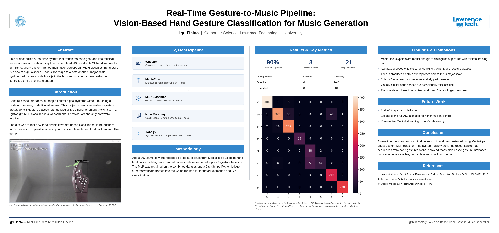

# Real-Time Gesture-to-Music Pipeline

Vision-based hand gesture classification for real-time music generation — a contactless instrument controlled entirely by hand shape.



## Overview

This project builds a real-time system that translates hand gestures into musical notes. A standard webcam captures video, [MediaPipe](https://github.com/google-ai-edge/mediapipe) extracts 21 hand landmarks per frame, and a custom-trained multi-layer perceptron (MLP) classifies the gesture into one of 8 classes. Each class maps to a note on the C major scale, synthesized instantly with [Tone.js](https://tonejs.github.io/) in the browser.

The live demo runs inside Google Colab, using a JavaScript–Python bridge to stream webcam frames into the Python runtime for landmark extraction and classification.

Built on [hand-gesture-recognition-using-mediapipe](https://github.com/kazuhito00/hand-gesture-recognition-using-mediapipe) by Kazuhito Takahashi (Apache 2.0), extended with 4 additional gesture classes and a Tone.js-based sound mapping layer.

## Pipeline

```
Webcam → MediaPipe (21 landmarks) → MLP Classifier (8 classes) → Note Mapping (C major scale) → Tone.js (audio)
```

## Results

| Configuration | Classes | Accuracy |
|---|---|---|
| Baseline | 4 | 96% |
| Extended | 8 | 90% |

- **90% accuracy** across 8 gesture classes (~300 samples per class)
- **21 keypoints** extracted per hand, per frame
- Near-perfect classification on Open, OK, ThumbsUp, and PinkyUp; the main confusion pairs are Close/ThumbsUp and ThreeFinger/Peace, since both involve visually similar hand shapes

This project builds on an earlier 4-gesture version of the pipeline, extending it to 8 gesture classes — accuracy dropped only 6% despite doubling the number of classes.

## Repo contents

- `hand_gesture_music.ipynb` — the live-streaming demo notebook (MediaPipe + MLP inference, run in Google Colab)
- `keypoint_classification.ipynb` / `keypoint_classification_EN.ipynb` — training notebooks for the hand-sign MLP classifier
- `point_history_classification.ipynb` — training notebook for the finger-gesture (point-history) classifier
- `app.py` — original local demo entry point from the base repo
- `sound_mapper.py` — maps a classified gesture to a note and triggers playback
- `model/` — trained classifier weights and labels
- `utils/` — helper utilities (e.g. FPS calculation)
- `gesture-music-poster-academic.png` — project poster (LTU Deep Learning Final Project)
- `LICENSE` — Apache 2.0, inherited from the base repo

## Running it

1. Open the notebook in [Google Colab](https://colab.research.google.com/).
2. Run the setup cells to install dependencies (MediaPipe, protobuf) and mount Google Drive for the trained model/labels.
3. Run the live-streaming demo cell and allow webcam access in the browser — it will detect your hand, classify the gesture, and play the mapped note live.

## Limitations & future work

- Colab's frame rate limits real-time melody performance
- The sound-cooldown timer is fixed and doesn't adapt to gesture speed
- Planned: left/right hand distinction, expansion to the full ASL alphabet, and WebSocket streaming to cut Colab latency

## Author

**Igri Fishta** — Computer Science & Artificial Intelligence, Lawrence Technological University
